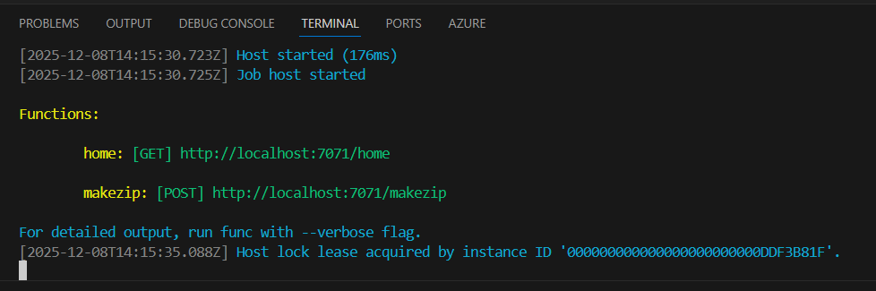

**Testing in Visual Studio Code**
1. Install Azure Functions Core Tools v4 using the following command 'winget install Microsoft.Azure.FunctionsCoreTools'
2. Install all the requirements mentioned in requirements.txt
3. In VS code terminal run 'func start' which will run the logic as a locally deployed function app.

On the terminal the endpoints will be displayed as shown in the below picture.

**API ENDPOINTS**
1. GET  -->  /home    --> Use this endpoint to check if system is up and running.
2. POST -->  /makezip --> Use this endpoint to send multiple files in json format which returns an archive / zip file as an output.

**API SAMPLE PAYLOAD**
[
    {
        "name": "FILENAME.docx",
        "content": "filename content"
        "encoding": "base64" // Use this if the file content is base64 encoded and not a string (Useful when zipping .docx, .pdf and .xlsx etc..)
    },
    {
        "name": "FILENAME1.txt",
        "content": "filename1 content"
    }
]

Runtime Stack: Python 3.11
